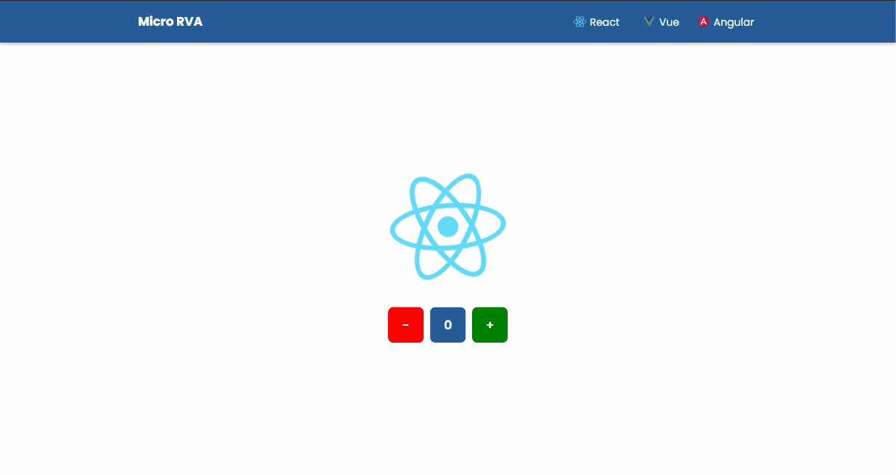

<h1 align="center">Micro RVA</h1>

<p align="center">Projeto utilizando a arquitetura de microfrontends, utilizando Single-Spa e mesclando React, Vue e Angular.<p>

<p align="center">
    <a href="#pre-requisitos">Pré-Requisitos</a> •
    <a href="#rodando-a-aplicacao">Rodando a Aplicação</a> •
    <a href="#tecnologias">Tecnologias</a> •
    <a href="#autor">Autor</a>
<p>

---



<h3 id="pre-requisitos">Pré-Requisitos</h3>
Antes de começar, você vai precisar ter instalado em sua máquina as seguinte ferramentas: <a href="https://git-scm.com" target="_blank">Git</a>, <a href="https://nodejs.org/en/" target="_blank">Node.js</a>. <br>
Além disto, é bom ter um editor para trabalhar com o código, como o <a href="https://code.visualstudio.com/" target="_blank">VSCode</a>.

<h3 id="rodando-a-aplicacao">Rodando a Aplicação</h3>

```bash
# Clone o repositório
$ git clone https://github.com/dududornelees/micro-rva.git
# Acesse a pasta do projeto no terminal
$ cd micro-rva
# Entre nas pastas e instale as dependências (root; styleguide; navbar; react; vue; angular)
$ yarn
# Entre nas respectivas pastas e inicie a aplicação (root; styleguide; navbar; react)
$ yarn start
# Entre na pasta "/vue" e inicie a aplicação (vue)
$ yarn serve
# Entre na pasta "/angular" e inicie a aplicação (angular)
$ yarn serve:single-spa:mfe
# O servidor iniciará na porta: 9000. Acesse http://localhost:9000
```

<h3 id="tecnologias">Tecnologias</h3>
As seguintes ferramentas foram utilizadas na construção deste projeto:

-   **Front-end**

    -   [React](https://pt-br.reactjs.org/)
    -   [TypeScript](https://www.typescriptlang.org/)
    -   [Styled-Components](https://styled-components.com/)
    -   [Single-Spa](https://single-spa.js.org/)
    -   [Vue](https://vuejs.org/)
    -   [Angular](https://angular.io/)

---

<h3 id="autor">Autor</h3>


Made with 💙 by Eduardo Dorneles 👋.

[](https://www.linkedin.com/in/dududornelees/) [](https://dududornelees.com.br/)
